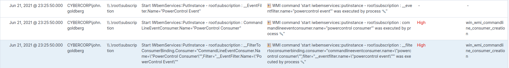
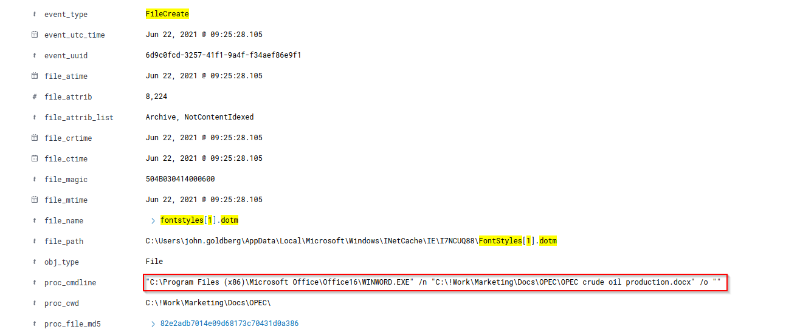
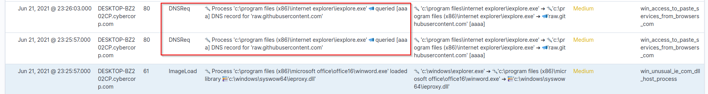
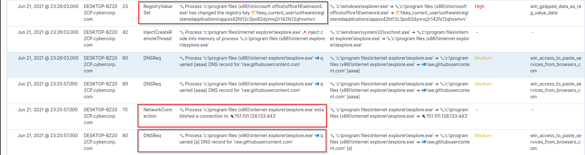
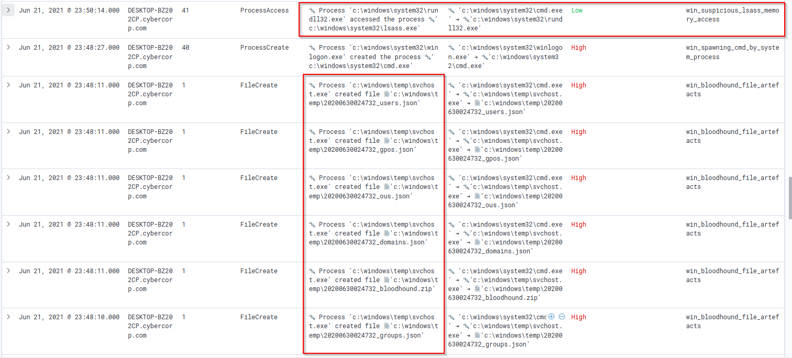

# CyberCorp Case 2 Writeup
---------------------------------------------------------------------


Lately I have been studying about threat hunting and I came across this awesome lab [CyberCorp Case 2](https://cyberdefenders.org/blueteam-ctf-challenges/75) on CyberDefenders authored by [BI.ZONE](https://bi.zone/). I decided to give this a try


### Question 1
```
The Threat Hunting process usually starts with the analyst making a hypothesis about a possible compromise vector or techniques used by an attacker. In this scenario, your initial hypothesis is as follows: "The attacker used the WMI subscription mechanism to obtain persistence within the infrastructure". Verify this hypothesis and find the name of the WMI Event Consumer used by the attacker to maintain his foothold.
```

Ans:

To attain persistence via WMI subscription we must interact with the WMI. Now this can be done via wmic.exe (commandline utility) as well as via COM. But in all cases events will be registered under `root\subscription` namespace. 

Luckily in the hunting data, we have three fields that provide us visibilty into WMI events namely `wmi_command`, `wmi_namespace` and `wmi_usr_fullname`


Let's filter for events occuring under the  EventNamespace `root\subscription`


We can see the registration of a WMI event consumer and an event filter. Finally the event consumer is bound the event filter. In total, 3 WMI events are triggered. 



Additional details: 
*Time of Event: Jun 21, 2021 @ 23:25:50.000
Host: DESKTOP-BZ202CP.cybercorp.com
User: CYBERCORP\john.goldberg
Process ID: 5772*

**Question 2**

```
In the previous step, you looked for traces of the attacker's persistence in the compromised system through a WMI subscription mechanism. Now find the process that installed the WMI subscription. Answer the question by specifying the PID of that process and the name of its executable file, separated by a comma without spaces.
```

Remember the process ID 5772 that we obtained from the logs, let's make a generic search. Let's put a filter `proc_file_name: exists`  to narrow down events and find the application corresponding to the event id.


Seems like its `winword.exe`.

**Question 3**

```
The process described in the previous question was used to open a file extracted from the archive that user received by email. Specify a SHA256 hash of the file extracted and opened from the archive.
```
Let's remove the `proc_file_name: exists` filter and check all documents that were opened/created using winword. For that let's add the `event_type: "FileOpen" OR event_type: "FileCreate"` in addition to the existing PID filter.


A number of documents have been opened which having extensions `docx` as well as `dotm`. Let's add the `enrich.ioa.max_confidence: exists` filter to find suspicious events.

In this case let me mention the EDR telemetry has a set of `enrich` fields that indicate level of confidence that a particular event is malicious.


Seems like we have artifacts of a remote dotm template injection attack. Let's verify it by capturing the specifics by focusing around the creation of the file. 



So we now have the file which fetched the remote template. 

*Time of Event: Jun 21, 2021 @ 23:25:44.000*

To look at the larger picture we need to check where network connections were made and events sorrounding it we will remove the filter  `event_type: "FileOpen" OR event_type: "FileCreate"`  while keeping the `enrich.ioa.max_confidence: exists` filter intact.


We observe a few outward `NetworkConnection` events made by winword.exe to IP's categorised as malicious by ESET while the same file was opened.

Let's check the IP on VirusTotal...


So according to the question the user received an archive which upon extraction this file was created. We will use the filter: `event_type : "FileCreate" AND "*zip*"`

And we have only one `FileCreate` event 


**Question 4**

```
The file mentioned in question 3, is not malicious in and of itself, but when it is opened, another file is downloaded from the Internet that already contains the malicious code. Answer the question by specifying the address, from which this file was downloaded, and the SHA256 hash of the downloaded file, separated by commas without spaces.
```

By this time we know that `fontstyles[1].dotm` is the malicious file that was downloaded form the above discussed IP.


We can see the series of events happening as Macro enabled --> network connection --> dotm file created --> dotm file opened

**Question 5**

```
The malicious code from the file, mentioned in question 4, directly installed a WMI subscription, which we started our hunting with, and also downloaded several files from the Internet to the compromised host. For file downloading, the attacker used a tricky technique that gave him the opportunity to hide the real process, which initiated the corresponding network activity. Specify the SHA256 hash of the operating system component whose functionality was used by the attacker to download files from the Internet.
```

Okay let's look at the flow of events after the dotm file was dropped and enrich the results with `enrich.ioa.max_confidence` . But we see a lot of events let's constrict our focus by locating events around the `Jun 21, 2021 @ 23:25:00.000` hour and we see


A bit of googling revealed that this dll when loaded in word.exe allows usage of Internet Explorer COM object in macros to interact with Internet resources. Parent child process dechaining takes place which may help evade some EDRs

Source: https://cyberpolygon.com/materials/hunting-for-advanced-tactics-techniques-and-procedures-ttps/

**Question 6**

```
Specify the domain name of the resource from which the files mentioned in question 5 were supposedly downloaded as a result of malicious code execution.
```

Looking at sorrounding documents and applying filter `enrich.ioa.rules: exist` we see that immediate DNS requests to github via iexplorer.exe is made. This verifies our suspicion that IE COM has been used.



The entry is marked as `win_unusual_ie_com_dll_host_process`

**Question 7**

```
The first file downloaded (as a result of executing the code in question 5) contained encoded executable code (PE), which after downloading was recorded in the registry. Specify an MD5 hash of the original representation of that code (PE).
```

There must be some network activity associated after the DNS resolution let's find out waht happend by looking at sorrounding events during the same time...

Very interestingly the  DNS request was made --> a network connection was initiated with an IP (from Fastly) --> registry key was changed by winword.exe



Looking at the particular log we see that it is marked as `win_gzipped_data_as_reg_value_data` and the `reg_value_data` stores the registry data as well.


Using cyberchef we are able to decode the PE file and obtain the md5 hash.


*Time of Event: Jun 21, 2021 @ 23:26:03.000*

**Question 8**

```
The second file downloaded (as a result of code execution, which we talked about in question 5) was a script, that was set up to autostart via WMI Subscription. Specify the SHA256 hash of this script.
```

Using the time range let's focus on events that happend from `Jun 21, 2021 21:00:00` to `Jun 22,2021 00:00:00`  after the WMI subscription event and look for malicious script download keeping the `enrich.ioa.max_confidence: exist` filter enabled.


Just after the suspicious DNS request to paste site (Github) we see a `MSO1033.ps1` file being created by winword.exe at *Jun 21, 2021 @ 23:26:09.000*

We use a generic filter `"mso1033.ps1"` around the same time interval to find that the FileCreate event is followed by script execution of the same file using powershell


According to the question it was supposedly executed due to triggering of the created WMI subscription. This can be verified by looking at one of the `FileOpen` events during the same time


Additional details: 
*Time of Event: Jun 21, 2021 @ 23:34:00.000
Host: DESKTOP-BZ202CP.cybercorp.com
Proc_usr_id: S-1-5-18 --> LocalSystem
Process ID: 5952*

Looking at few other `FileOpen` events around the same time gives us the hash of the script


**Question 9**

```
The script, mentioned in question 8, spawned one of the legitimate system processes and injected into its memory a malicious code that was read and decoded from the registry (this code was mentioned in question 7). This malicious code migrated through a chain of code injections to the address space of another legitimate process, where it continued to run without further migration. For this answer, provide the next data, separated by a comma without spaces:

-   PID of the initial legitimate system process, which was spawned by the script and where this script launched in-memory execution of malicious code;
    
-   PID of the target process, to which malicious code migrated from the initial process and in the context of which attacker performed different post-exploitation activity
```

Okay let's extract and review the powershell script. 


*Time of Event: Jun 21, 2021 @ 23:41:15.000*

The events are categorised as `win_empire_functions_and_cmdlets, win_possible_reflective_pe_injection_functions` In order to extract the powershell script we will concatenate the `script_text` field for each of the 7 events after applying JSON Unescape on each of them.

A quick review of the script suggests that the value corresponding to the registry key was decoded (base64 as well as gzip) and the PE bytes were stored in the form of a byte array in `$PEBytes`


Next we see that invocation of  Win32 APIs is done via the **Add-type** cmdlet 


Additionally whenever `Add-Type` is used to compile C#, code forensic artifacts can be found on disk usually in the temp folder.


And finally we have evidence of PPID spoofing ie `dwm.exe` is created with `winlogon.exe` as spoofed parent and the PE file extracted from registry is reflectively loaded into the memory space of dwn.exe using `Invoke-MemoryLoadLibrary` (Powersploit function for reflective PE injection)


Keeping the same filter `"mso1033.ps1"` enabled, if we look at the events after the script execution has taken place we see two events with high confidence of malicious activity which corroborate with our findings.


*Time of event: Jun 21, 2021 @ 23:41:56.000
PID of powershell.exe: 7324
PID of winlogon.exe: 1160
PID of dwm.exe: 8876*


**Question 10**

```
The malicious code run by the script is a Reverse Shell. Identify the IP address and port number of its command center.
```

The next steps would be to view events around `dwm.exe`.


A quick search using the process ID shows that `rundll32.exe` was spawned by `dwm.exe`. Most probably rundll32.exe will be used to run the reverse shell DLL extracted from registry so we should be looking for a Network Connection next. Let's query by rundll32 PID - 8344 and look at events during the same time


And BINGO! we have a network connection to an external IP from rundll32.exe

*Time of event: Jun 21, 2021 @ 23:41:56.000
Host: DESKTOP-BZ202CP.cybercorp.com*

**Question 11**

```
As a result of running a malicious code, which we talk about in questions 9 and 10, the attacker got a shell on the compromised host. Using this access, the attacker downloaded the Active Directory collection utility to the host in an encoded form. Specify a comma-separated, non-spaced link where the encoded version of the utility was downloaded and a SHA256 hash of the decoded version that was directly run by the attacker on the compromised host.
```

From the question we know that a reverse shell was established and a file was downloaded so we need to look for `Network Connection` + `FileCreate` events after the initial rundll network connection took place.

We see a lot of network connections from `chrome.exe` to get limited but interesting events we will apply a not filter to the same. Our final filter looks like: `(event_type : "NetworkConnection" or event_type : "filecreate") and not proc_p_file_path : "C:\Program Files (x86)\Google\Chrome\Application\chrome.exe"`


And we see interesting events at *23:46:10.000*. Usage of certutil by itself is not malicious but certutil making a network connection and creating a file by the name of `svchost.exe` and `chrome_installer.log2` is indeed very suspicous. certutil has a history of being used by threat actors as a lolbin to download and decode files onto disk


Moving down a little bit in the timeline we have artifacts of bloodhound being run on the system.

In all probability certutil.exe was used to download `chrome_installer.log2` which is base64 encoded form of Bloodhound and then certutil was again used to decode and save it to disk by the name of `svchost.exe`

Let's verify this by applying the filter `enrich.ioa.max_confidence : exists` in the `Jun 21, 2021 @ 23:40:00.000 - Jun 21, 2021 @ 23:50:00.000` time range.


*Time of event: Jun 21, 2021 @ 23:46:16.000*

**Question 12**

```
During the post-exploitation process, the attacker used one of the standard Windows utilities to create a memory dump of a sensitive system process that contains credentials of active users in the system. Specify the name of the executable file of the utility used and the name of the memory dump file created, separated by a comma without spaces.
```

In all probablity this maybe lsass.exe but let's verify the same. Using the time range `Jun 21, 2021 @ 23:40:00.000 - Jun 22, 2021 @ 01:00:00.000` and `enrich.ioa.max_confidence : exists` filter let's look for suspicious events.



A lot of bloohound artifacts followed by lass memory access by rundll32.exe. 


And indeed rundll32 is being utilised to invoke the exported `MiniDump` function from `C:\windows\system32\comsvcs.dll`  and dump lsass.

Source: https://lolbas-project.github.io/lolbas/Libraries/comsvcs/

*Time of event: Jun 21, 2021 @ 23:50:11.535*

**Question 13**

```
Presumably, the attacker extracted the password of one of the privileged accounts from the memory dump we discussed in the previous question and used it to run a malicious code on one of the domain controllers. What account are we talking about? Specify its username and password as the answer in login:password format.
```

Okay so the host we are currently on - DESKTOP-BZ202CP.cybercorp.com is not a DC. In order to execute code on the DC there must be some kind of lateral movement. Keeping the same filters let's look for suspicious events after lsass dumping takes place.


Just after lsass dump we see DNS queries for `dc-01.cybercorp.cybercorp.com` 

 To obtain DC ip address just add the filter  `event_type: "NetworkConnection" and dev_fqdn: "DC01-CYBERCORP.cybercorp.com"` and check `dev_ipv4` for any entry.
  
 *DESKTOP-BZ202CP.cybercorp.com  IP: 192.168.184.130
 DC01-CYBERCORP.cybercorp.com IP: 192.168.184.100* 
 
Next we need to find some lateral movement artifact on current host, let us use the filter 
 `enrich.ioa.max_confidence : exists` and `dev_fqdn: DESKTOP-BZ202CP.cybercorp.com` and look at all events upto 1 hr of lsass dumping


 
 
 
 And we see that `wmic.exe` was used to launch a new process on the DC.
 This new process  `regsvr32.exe` was used to download and execute a remote COM scriplet.
 
 On the DC machine we should be able to see a Process Create event followed by a Network connection. Let's check for the same by changing the `dev_fqdn` filter to the DC hostname.
 
 
 
 *Time of event: Jun 22, 2021 @ 00:19:25.000*

 Following the trail, just a little later we see the `regsvr32.exe` spawns `powershell.exe` with Proc ID 5576 that is use to download a file 
 
 Let's follow the process ID and check events corresponding to the same under the filter `proc_id:5576 OR proc_p_id:5576 OR proc_c_id:5576 OR proc_tgt_id:5576`
 
 
 
  A new powershell process (PID: 4460) is spawned that decrypts a base64+gzip encoded string and executes the same
 
 Let's try to decrypt it using CyberChef
 
 

And we have a powershell script let's quickly analyse the same


The function `cT_` uses a *getprocaddress-getmodulehandle* powershell implementation to get address of a function inside a module both specified as its parameters.

The function `dy` is used to get the delegate type of the function passed and declare accordingly.

And we have a base64 encoded string read into a bytearray `$bj` and finally we have a VirtualAlloc-CreateThread API that creates a thread in powershell process space that runs the shellcode stored inside `$bj` . This is supported by the fact that the event is categorized as `win_possible_reflective_pe_discovered_in_calltrace`

*Powershell PID (old): 5576
Powershell PID (new): 4460*

Let's follow the investigation around the same time frame with the newly spawned powershell process using the filter `proc_id:4460 OR proc_p_id:4460 OR proc_c_id:4460 OR proc_tgt_id:4460`


And we can see the Process Create event is followed by an outbound Network Connection to a remote IP on port 8443

 **Question 14**
 
 ```
 A compromised user account is a member of two Built-in privileged groups on the Domain Controller. The first group is the Administrators. Find the second group. Provide the SID of this group as an answer.
 ```
 
So we need to audit group membership for user `inventory`on the domain controller. We will use the filter `event_type: "accountgrouplist"  and usr_tgt_name : "inventory"`


 
The log contains `usr_token_groups` as one of the fields. This field contains the list of SIDs due to a transitive group membership expansion operation on a given user ie the SID of all groups that the user is part of directly or due to recursive group membership.

```
%{S-1-5-21-3899523589-2416674273-2941457644-513}
%{S-1-1-0}
%{S-1-5-32-544}
%{S-1-5-32-551}
%{S-1-5-32-545}
%{S-1-5-32-554}
%{S-1-5-2}
%{S-1-5-11}
%{S-1-5-15}
%{S-1-18-1}
%{S-1-5-21-3899523589-2416674273-2941457644-1105}
%{S-1-16-12288}
```

Since its a built-in privilege group let's head over to https://docs.microsoft.com/en-us/windows/security/identity-protection/access-control/active-directory-security-groups and search with the corresponding RID's

And we have a match...


**Question 15**
 
 ```
As a result of malicious code execution on the domain controller using a compromised account, the attacker got a reverse shell on that host. This shell used a previously not seen IP address as the command center. Specify its address as the answer.
 ```
 
 Well now we know that the outbound network connection was a reverse shell from the DC.
 
 
